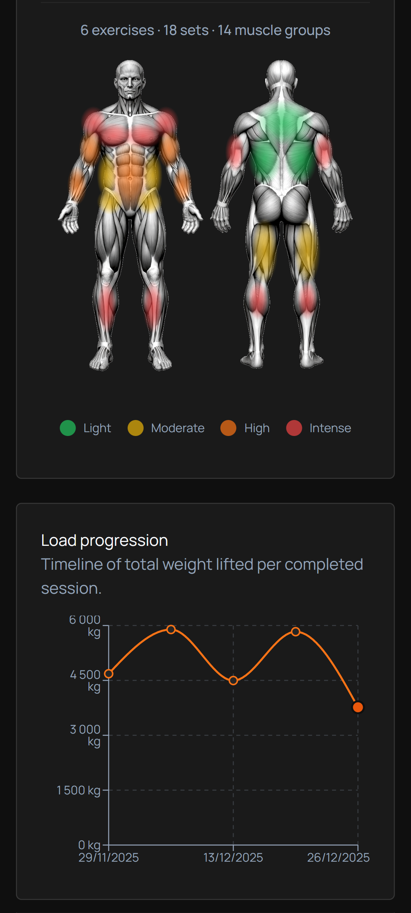
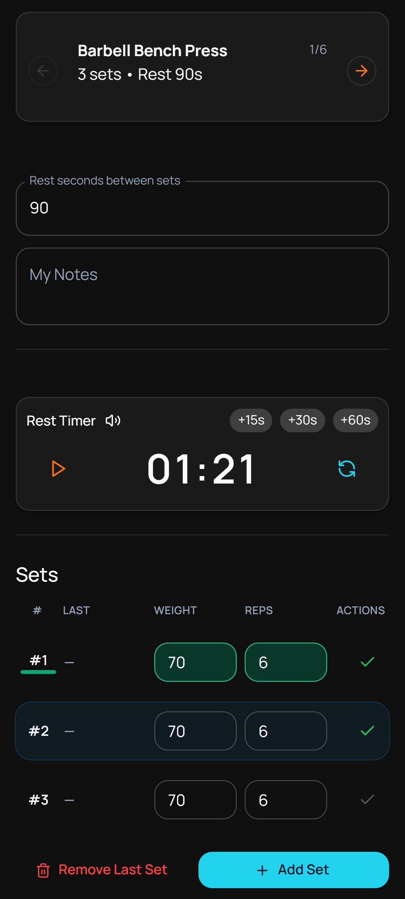
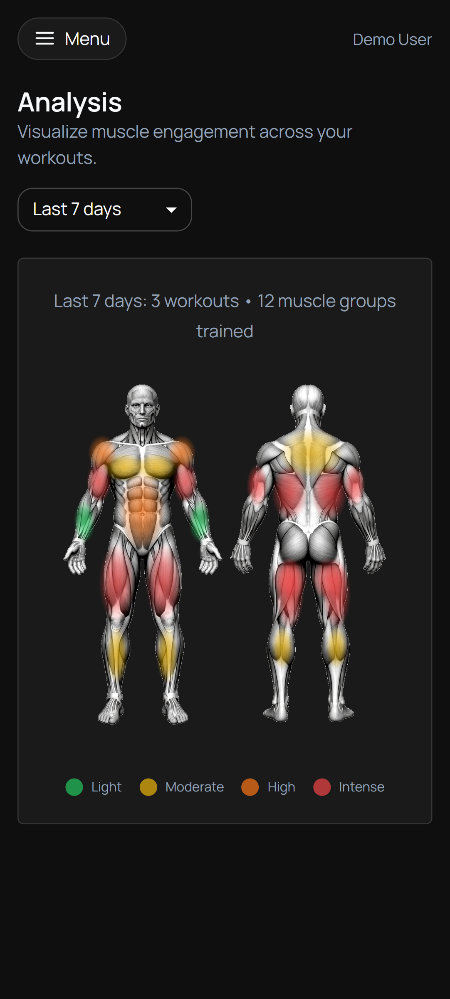
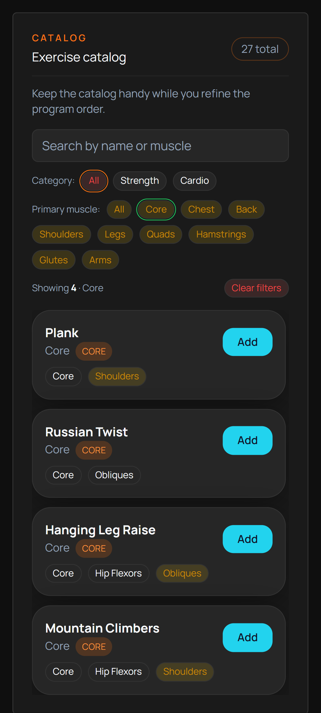
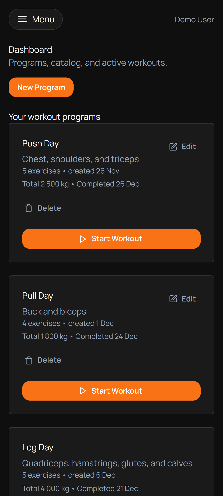
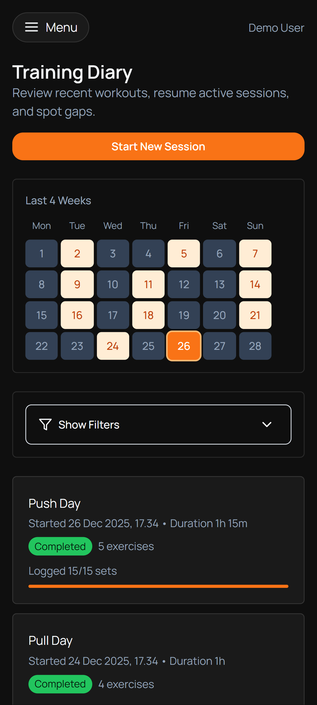

<p align="center">
  
</p>

<p align="center">
  
</p>

# GymTrack

A Progressive Web Application (PWA) for planning, running, and tracking strength and cardio workouts. Create workout programs, execute training sessions, log your sets/reps/weights in real-time, and analyze your muscle engagement over time.

## Features

- **Workout Program Builder** - Create and edit workout programs with 100+ exercises, configure sets, reps, weights, and rest times with drag-and-drop reordering
- **Session Runner** - Execute workouts with real-time logging, configurable rest timers with audio alerts, and swipe gestures for mobile
- **Training Diary** - View all past and in-progress sessions with calendar visualization and filtering
- **Analysis Dashboard** - Visual muscle map showing engagement intensity over configurable time ranges
- **Exercise Catalog** - Pre-seeded database with strength and cardio exercises including muscle engagement data
- **Progressive Load Charts** - Track total weight lifted per session and exercise-specific progression

## Tech Stack

### Frontend
| Technology | Purpose |
|------------|---------|
| React 19 | UI framework |
| TypeScript | Type safety |
| Vite 7 | Build tool and dev server |
| React Router 7 | Client-side routing |
| TanStack Query | Server state management |
| Zustand | Client state management |
| Material UI 7 | Component library |
| Tailwind CSS 3 | Utility-first CSS |
| React Hook Form + Zod | Form handling and validation |
| Recharts | Data visualization |

### Backend
| Technology | Purpose |
|------------|---------|
| .NET 9 / ASP.NET Core | Web API framework |
| Entity Framework Core 9 | ORM and database access |
| SQL Server 2025 | Database |
| ASP.NET Identity + JWT | Authentication |

### Infrastructure
| Technology | Purpose |
|------------|---------|
| Docker | Containerization |
| Docker Compose | Multi-container orchestration |

## Getting Started

### Prerequisites
- Node.js 20+
- .NET 9 SDK
- Docker and Docker Compose (for containerized deployment)

### Development Setup

**Frontend only (with mock data):**
```bash
cd frontend
npm install
npm run dev:mock      # Runs on http://localhost:5173
```

**Frontend only (requires backend):**
```bash
cd frontend
npm install
npm run dev           # Runs on http://localhost:5173
```

**Full Stack (Docker Compose):**
```bash
docker-compose up
# App available at http://localhost:5087
# SQL Server at localhost:1433
```

### Environment Variables

Key environment variables (configured in `docker-compose.yml`):

| Variable | Description |
|----------|-------------|
| `JWT_SECRET` | Secret key for JWT token signing |
| `DB_HOST` | Database host |
| `DB_NAME` | Database name |
| `DB_USER` | Database user |
| `DB_PASSWORD` | Database password |
| `INVITE_CODE` | Registration invitation code (default: `devinvite`) |

### Build Commands

**Frontend:**
```bash
npm run build         # Production build
npm run lint          # ESLint check
```

**Backend:**
```bash
dotnet restore ./backend/GymTrack.sln
dotnet build ./backend/GymTrack.sln
dotnet test ./backend/GymTrack.sln
```

**Docker:**
```bash
docker build -t gymtrack .
```

## Project Structure

```
gymtrack/
├── frontend/                       # React SPA
│   ├── src/
│   │   ├── api/                    # API client and requests
│   │   ├── components/             # React components
│   │   │   ├── dashboard/          # Dashboard components
│   │   │   ├── program-builder/    # Program builder
│   │   │   ├── session-runner/     # Session runner
│   │   │   └── ui/                 # Reusable UI primitives
│   │   ├── hooks/                  # Custom hooks
│   │   ├── pages/                  # Page components
│   │   ├── store/                  # Zustand stores
│   │   ├── types/                  # TypeScript types
│   │   └── utils/                  # Utilities
│   └── public/                     # Static assets
│
├── backend/
│   ├── src/GymTrack.Api/
│   │   ├── Application/            # Service interfaces and DTOs
│   │   ├── Controllers/            # API endpoints
│   │   ├── Domain/                 # Domain models and enums
│   │   └── Infrastructure/         # EF Core, Identity, Services
│   └── tests/                      # Unit and integration tests
│
├── docs/                           # Documentation
├── docker-compose.yml              # Multi-service orchestration
└── Dockerfile                      # Multi-stage build
```

## API Endpoints

| Method | Endpoint | Description |
|--------|----------|-------------|
| POST | `/api/auth/register` | Create new account |
| POST | `/api/auth/login` | Authenticate and get JWT |
| GET | `/api/exercises` | List exercise catalog |
| GET/POST | `/api/programs` | List/create programs |
| GET/PUT/DELETE | `/api/programs/{id}` | Program CRUD |
| POST | `/api/programs/{id}/sessions` | Start workout session |
| GET | `/api/sessions` | List sessions |
| GET | `/api/sessions/{id}` | Get session details |
| PATCH | `/api/sessions/{id}/sets/{setId}` | Update set actuals |
| POST | `/api/sessions/{id}/complete` | Complete session |
| GET/PATCH | `/api/profile` | User preferences |

## Screenshots

<p align="center">
  
  
  
</p>

<p align="center">
  
  
  
</p>

## License

Copyright 2026 Tommi Laukkanen.

This project is proprietary software.
